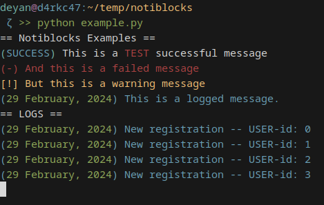

# Notiblocks




*Quick and easy customizable terminal logs for your python application.*
<br />
> Find, support and contribute to the project's source code [`here`](https://github.com/notiblocks/notiblocks) 

## Table of Contents

- [`Introduction`](#introduction)
- [`Features`](#features)
- [`Installation`](#installation)
- [`Usage`](#usage)
- [`Contributing`](#contributing)
- [`License`](#license)

## Introduction

Welcome to Notiblocks, a versatile Python library designed to enhance terminal logging with customizable and intuitive features.


### Documentation
If you want to **learn** how to use `notiblocks`, check the [`documentation`](https://app.gitbook.com/o/4FBvhI5UXLbq0HL9OCTS/s/z6b70RGC8WhxZqoCAV0k/)
### What is Notiblocks?

Notiblocks is more than just a logging library; it's a powerful tool that simplifies and elevates your terminal logging experience. It offers a user-friendly interface for creating custom, eye-catching logs, allowing developers to seamlessly integrate informative and visually appealing messages into their applications.

### Why Notiblocks?

- **Simplicity**: With Notiblocks, logging becomes effortless. Its intuitive design makes it easy to craft customized terminal logs without complex configurations.
  
- **Customization**: Tailor your logs to suit your application's needs. Notiblocks offers a wide range of styling options, allowing you to create logs that stand out.

- **Versatility**: Whether you're working on a small script or a large-scale project, Notiblocks scales to meet your logging requirements.

## Features

- Customizable log styles and colors
- Easy integration into existing projects
- Make your own logging templates and reuse them whenever you want to
- Inline formatting, so you could add anything you want in the logs
- Low resource usage

## Installation

Install notiblocks trough pip

```bash
pip install notiblocks
```

And just import the module into your application

```python
import notiblocks
```

## Usage
Notiblocks uses `NBConfig` and `NBHandler` objects, which let you customize your logs by your needs. You can access them trough the module.

* **`NBConfig`**: Holds the information about how your logs will look. You can override the information trough the constructor, or through the setters. For further explanation check the [`docs`](/docs/documented/nbconfig.md).
* **NBHandler**: Wrapper class for the `NBConfig`, which provides the main functionalities as `success`, `fail`, `warn` and `log`. For further information check the [`docs`](/docs/documented/nbhandler.md).
* **ILFormatter**: Let's you create custom inline formatting using the `$` sign and providing the configuration as a list. For more brief look, check the [`docs`](/docs/documented/ilformatter.md)

Example:
```python
from notiblocks import NBConfig, NBHandler
from notiblocks import ILFormatter

nb_conf = NBConfig(
    success_sign_color="blue",
    time_sign_color="GrEEn",
    success_sign="SUCCESS",
    success_bracket_color="cyan",
    time_sign_stamp="DATE",
    bracket_style="round     ",
    warn_bracket_sign="square"
)

nb_handler = NBHandler(nb_conf)

print(nb_handler.success(ILFormatter.format("This is a $TEST$ successful message", ["red"])))

print(nb_handler.fail("Notiblocks is still not in a finished state..."))
print(nb_handler.warn("You haven't smiled enough today :)"))
print(nb_handler.log(f"User {page.user} accessed this page"))
```

## Contributing
The notiblocks team would be more than happy to see your code suggestions. If you want to help out in some way - you could!
* **We wellcome feature ideas!** - If you want to see something in the project, that **you** think would be usable and would make your life easier, open a discussion, issue or even implement it! Before commiting, though, check the [`contribution guidelines`](/CONTRIBUTING.md) :)

## License
Notiblocks is licensed under the MIT License, check [`LICENSE`](/LICENSE) for more information.

### Join us on the journey to transform your terminal logging experience with Notiblocks!
